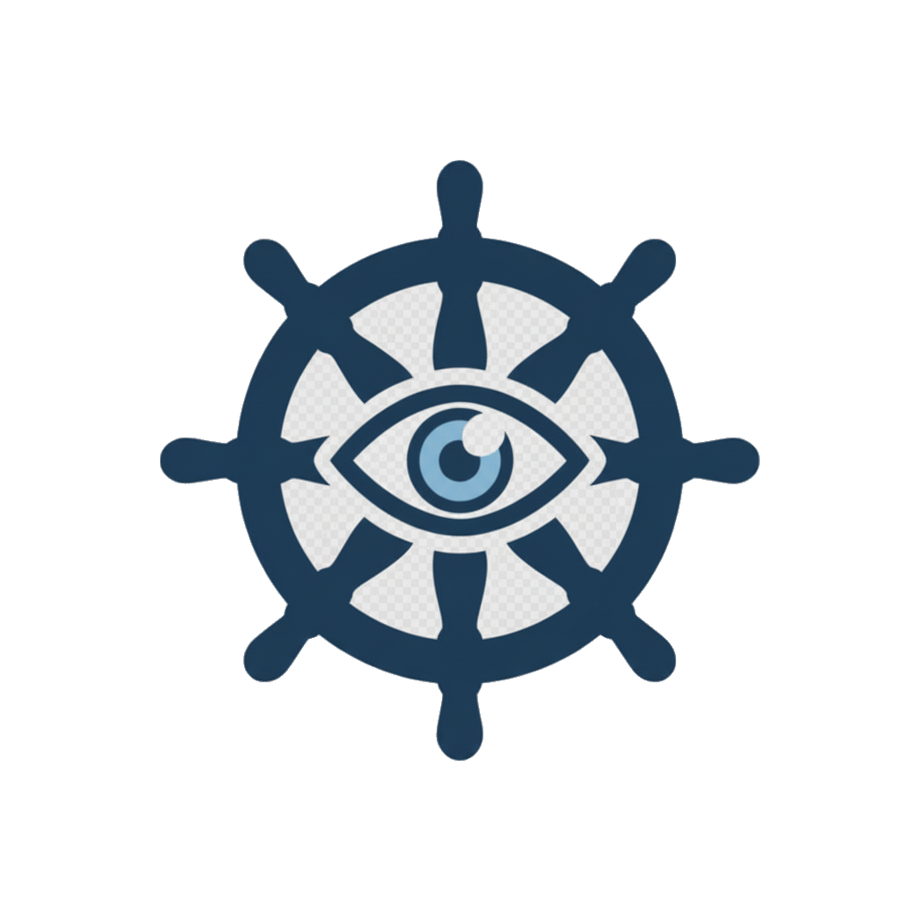

# DeckWatch



This project was generated using [Angular CLI](https://github.com/angular/angular-cli) version 20.3.7.


# DeckWatch

DeckWatch is an Angular frontend for historical video exploration on top of Frigate. The current repository contains architecture and implementation planning documents plus an initial Angular scaffold aligned to that plan.

## Local development

Before starting the app, create your local config files from the tracked examples and fill in your own Frigate server details (these files are gitignored so your real network details never get committed):

```bash
cp proxy.conf.example.json proxy.conf.json
cp public/runtime-config.example.json public/runtime-config.json
```

Then edit `proxy.conf.json` and `public/runtime-config.json` to point at your Frigate instance.

Start the development server:

```bash
npm start
```

The development server uses `proxy.conf.json` to forward Frigate auth, API, and media requests to your configured Frigate origin.

Build the application:

```bash
npm run build
```

Run unit tests:

```bash
npm test
```

## Building

## Repository structure

- `docs/01-architectural.md`: high-level system architecture
- `docs/02-implementation-spec.md`: Angular structure, contracts, and state model
- `docs/03-endpoint-mapping.md`: Frigate adapter and endpoint mapping guidance
- `docs/04-delivery-backlog.md`: phased work backlog and execution order
- `src/app`: Angular application shell and implementation skeleton


## Runtime configuration

Runtime configuration is served from `public/runtime-config.json` and loaded before Angular bootstraps. This keeps Frigate base URLs and deployment-mode switches out of the compiled application bundle.

Current runtime config fields:

- `frigateBaseUrl`
- `proxyBaseUrl`
- `deploymentMode`
- `authMode`
- `previewFramesEnabled`
- `reviewOverlayEnabled`
- `requestTimeoutMs`

For the current local-network setup:

- `deploymentMode` is `proxy`
- `authMode` is `cookie`
- Angular dev-server proxies `/login`, `/auth`, `/api`, and media paths to the Frigate instance

## Current implementation state

The app is scaffolded with standalone Angular APIs and prepared for the first vertical slice:

- runtime configuration bootstrap and DI token
- Frigate adapter boundary
- camera workspace state
- timeline rendering and playback integration

## Next implementation slice

1. Add runtime configuration loading and adapter tokens.
2. Build the camera workspace store and camera catalog loading.
3. Implement recordings queries and first-pass timeline projection.
