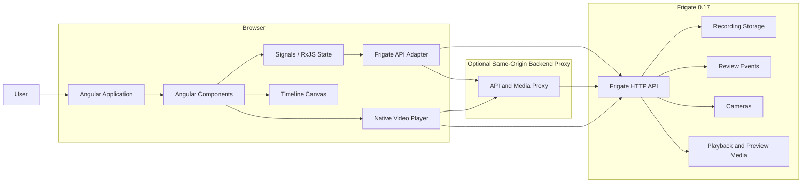
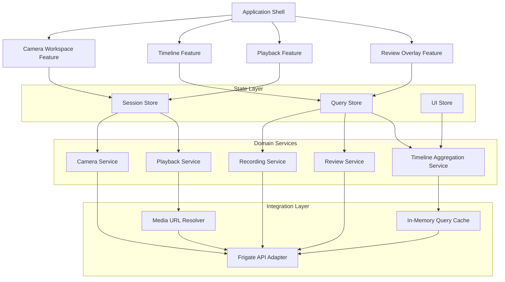
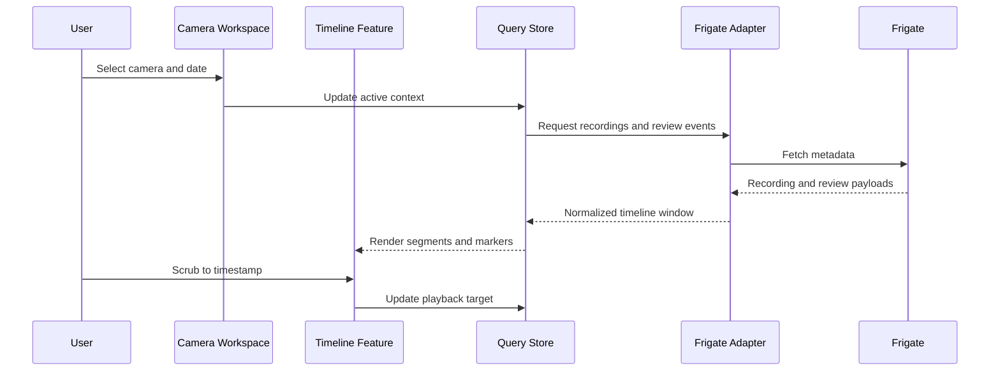
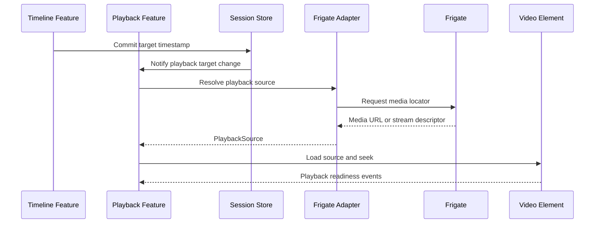

# Frigate API and Angular Frontend Architecture

## Overview

This document describes the high-level architecture for an Angular frontend that provides a historical-video browsing experience backed by Frigate.

The Angular application is responsible for:

- Camera selection.
- Timeline rendering.
- Recording and event visualization.
- Timeline scrubbing.
- Preview-frame display.
- Playback control.
- User interaction and accessibility.

Frigate remains responsible for:

- Camera management.
- Recording storage.
- Review events.
- Motion and object detection metadata.
- Historical video access.
- Preview or thumbnail data, where supported.

The frontend must access Frigate through an isolated API adapter. Angular components must not call Frigate endpoints directly.

---

## System context

## Architectural goals

The design must satisfy the following goals:

- Keep Frigate as the source of truth for recordings, reviews, and camera metadata.
- Isolate all Frigate integration logic behind a dedicated adapter layer.
- Support responsive exploration of historical footage across multiple cameras and long time ranges.
- Preserve a simple path from preview browsing to full playback.
- Remain deployable either directly against Frigate or through a same-origin proxy when CORS, auth, or media routing require it.
- Allow the UI to tolerate partial API failures without collapsing the full browsing session.

## Non-goals

The first architecture iteration does not attempt to:

- Replace Frigate playback, transcoding, storage, or detection pipelines.
- Provide video editing, export workflows, or annotation authoring.
- Introduce a custom backend domain model that diverges from Frigate unless a proxy is required for transport concerns.
- Solve fleet management for multiple Frigate servers in the initial release.

## Design principles

- Components render state; they do not own transport logic.
- Domain state is normalized around cameras, time windows, recordings, events, and playback session state.
- Media and metadata flows are separated so that the timeline remains usable even when full playback is delayed.
- Expensive timeline rendering is incremental and viewport-aware.
- Every Frigate-facing call is observable, typed, and replaceable for testing.

## Logical architecture

## Frontend feature model

The Angular application should be organized as a small set of feature slices with clear responsibilities.

### 1. Application shell

The shell owns route resolution, configuration bootstrap, global error handling, and shared layout. It also initializes the adapter configuration, including Frigate base URL, optional proxy URL, authentication mode, and feature flags.

### 2. Camera workspace feature

This feature controls camera selection, current time window, workspace filters, and persisted user preferences. It should expose a stable state contract that other features consume rather than duplicating camera context.

### 3. Timeline feature

This feature renders time navigation, recording density, event markers, scrub interactions, preview positioning, and viewport zoom. It is the main consumer of aggregated recording and review metadata.

### 4. Playback feature

This feature resolves playable media URLs, coordinates video element state, manages seek synchronization with the timeline, and handles playback fallback when media segments are missing or delayed.

### 5. Review overlay feature

This feature renders review events, motion/object markers, tooltips, filtering, and event-driven jumps into playback. It should remain optional over the base timeline so playback still functions if review metadata is unavailable.

## State model

The UI should maintain three primary state categories.

### Session state

Session state describes durable user context for the current browser session:

- Selected camera or camera group.
- Active date and visible time window.
- Playback target timestamp.
- Zoom level and timeline density preferences.
- Review filter preferences.

### Query state

Query state tracks remote data lifecycle:

- Camera catalog and availability.
- Recording windows by camera and time range.
- Review events by camera and time range.
- Preview frame metadata or thumbnail references.
- Playback URL resolution state.

### UI state

UI state covers ephemeral interaction details:

- Hovered timestamp.
- Drag and scrub state.
- Tooltip visibility.
- Pending seek indicators.
- Loading placeholders and transient errors.

## Data contracts

The adapter layer should define frontend-owned interfaces that decouple components from raw Frigate responses. Even if these interfaces map closely to Frigate today, they should still be explicit.

Recommended domain contracts:

- `CameraSummary`: id, display name, enabled state, capabilities, timezone assumptions.
- `RecordingSegment`: camera id, start time, end time, duration, media locator, quality metadata.
- `ReviewEvent`: event id, camera id, start time, end time, severity or type, label summary, bounding metadata when available.
- `PreviewFrame`: camera id, timestamp, image locator, width, height, capture source.
- `PlaybackSource`: camera id, requested timestamp, resolved media URL, playable start/end window, transport type.
- `TimelineWindow`: requested start/end, loaded start/end, density metrics, gaps, event counts.

The adapter should also map transport errors into a frontend error taxonomy such as:

- authentication failure
- authorization failure
- camera unavailable
- time window empty
- media resolution failure
- transient network failure

## Integration strategy

The Frigate adapter is the architectural boundary that all features depend on.

### Adapter responsibilities

- Expose typed methods for cameras, recordings, reviews, previews, and media resolution.
- Translate Frigate response shapes into frontend domain contracts.
- Centralize URL construction, query parameter handling, and auth header attachment.
- Normalize transport errors.
- Emit request metrics and debug logging hooks.

### Optional proxy responsibilities

An optional backend proxy should only exist for deployment concerns that the browser cannot cleanly solve:

- Same-origin access for media and API calls.
- Credential isolation or token exchange.
- Response caching for expensive timeline queries.
- URL signing or stream indirection.
- Cross-endpoint aggregation if Frigate requires multiple requests for one frontend use case.

If a proxy is introduced, it should remain thin and avoid re-implementing domain behavior already present in the frontend unless doing so materially reduces latency or complexity.

## Primary user flows

### Historical browse flow

### Playback resolution flow

## Timeline rendering plan

Timeline rendering is the highest-risk UI surface and should be treated as a dedicated subsystem.

### Rendering approach

- Use canvas for dense segment visualization and marker drawing.
- Overlay accessible HTML controls for keyboard navigation, selection state, and descriptive labels.
- Render only the visible window plus a small overscan buffer.
- Bucket recordings and events by zoom level so coarse views do not attempt per-frame precision.

### Interaction behavior

- Hover should resolve nearest meaningful timestamp without forcing media loads.
- Scrub should update a lightweight preview indicator first, then schedule playback resolution.
- Zoom changes should preserve the focal timestamp to avoid disorienting jumps.
- Keyboard controls should support stepping by configurable intervals.

### Performance constraints

- Timeline redraw should remain bounded to viewport changes, hover state, or loaded data changes.
- Network requests for adjacent windows should be pre-fetched opportunistically but canceled when context changes.
- Preview frame requests should be debounced and deduplicated.

## Playback strategy

Playback should be resilient to the realities of historical media.

- Prefer resolved Frigate-native playback URLs where time-based seeking is reliable.
- Maintain a fallback path when the requested timestamp lands in a recording gap.
- Surface exact loaded media bounds so the timeline can indicate when the user is outside the playable interval.
- Keep timeline scrubbing and video seek state synchronized, but avoid making the video element the single source of truth for navigation.

## Error handling and resilience

The UI should degrade by feature, not fail as a whole.

- If camera metadata loads but review events fail, show recordings and playback while flagging review unavailability.
- If preview frames fail, preserve scrub and playback interactions with a lower-fidelity hover state.
- If playback resolution fails for a timestamp, keep the timeline position and present recovery actions such as nearest recording jump.
- Distinguish empty data from failed data so operators do not mistake a quiet time range for a transport problem.

## Security and deployment

The architecture should support these deployment modes:

- Direct browser-to-Frigate access for trusted LAN deployments.
- Same-origin proxy deployment for authenticated or remote access scenarios.
- Reverse-proxy hosted SPA deployment where static assets and proxied API/media share a public origin.

Security requirements:

- Never hardcode Frigate credentials in the frontend bundle.
- Treat media URLs as sensitive when they embed tokens or signed parameters.
- Keep configuration injection environment-driven.
- Ensure CORS, CSP, and caching headers are compatible with media playback.

## Observability

The frontend should emit structured client telemetry for:

- adapter request latency and failure counts
- timeline render timing
- preview fetch frequency and cancellation rate
- playback resolution success rate
- user-visible error categories

This does not require a full analytics platform in the first iteration, but the architecture should expose instrumentation hooks instead of burying logging inside components.

## Testing strategy

The plan should be validated with tests at three levels.

### Unit tests

- Adapter response mapping.
- Timeline aggregation and bucketing logic.
- Playback state transitions.
- Error classification.

### Integration tests

- Camera selection updates timeline and playback context.
- Scrub interactions trigger preview and playback resolution correctly.
- Review filters affect marker rendering without corrupting playback state.

### End-to-end tests

- Browse a day of recordings for one camera.
- Jump from a review event to playback.
- Handle empty time windows and missing segments.
- Validate keyboard accessibility for timeline navigation.

## Delivery plan

### Phase 1: Foundation

- Define adapter interfaces and domain contracts.
- Build configuration bootstrap and deployment mode handling.
- Implement camera loading and base workspace state.

### Phase 2: Metadata browsing

- Implement recordings and review-event queries.
- Build first-pass timeline rendering with zoom and scrub.
- Add empty-state and error-state handling.

### Phase 3: Playback integration

- Resolve playback sources from timeline selection.
- Synchronize video state with timeline state.
- Add preview-frame interaction and nearest-segment fallback.

### Phase 4: Hardening

- Add caching, cancellation, and adjacent-window prefetch.
- Add observability hooks.
- Complete accessibility and performance tuning.
- Validate direct and proxy deployment modes.

## Open architecture decisions

The following decisions should be closed before implementation deepens:

- Whether the first release targets standalone cameras only or supports grouped multi-camera timelines.
- Whether preview frames come from a Frigate-native endpoint, derived thumbnails, or sampled video seeks.
- Whether a proxy is mandatory for the target deployment environment.
- Which time semantics are authoritative when browser locale and Frigate timezone differ.
- Whether playback uses direct media URLs, HLS-like transport, or Frigate-generated clips for historical seeking.

## Recommended next artifact

The next document should convert this architecture into an implementation specification with:

- chosen Angular project structure
- concrete adapter method signatures
- state store shape
- endpoint mapping table
- timeline interaction contract
- deployment configuration examples
