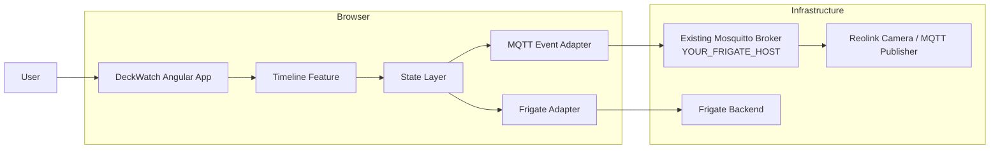
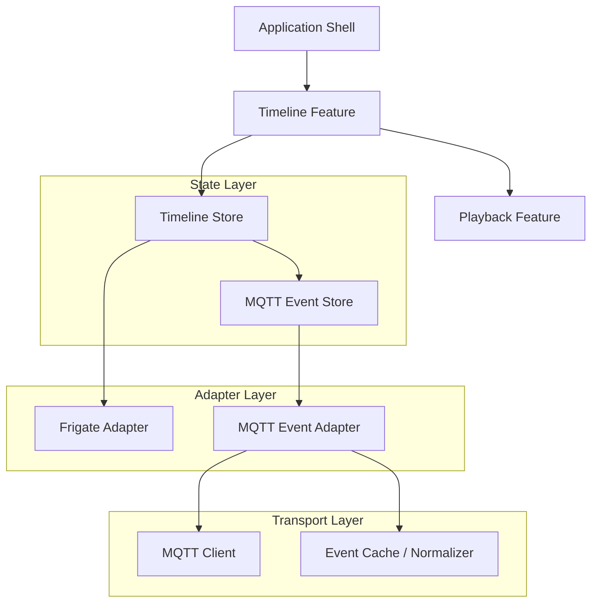

# Reolink MQTT Event Integration Architecture

## Overview

This document describes an architectural approach for consuming Reolink camera events from an MQTT message broker and presenting them on the DeckWatch timeline as pill-shaped markers aligned with their occurrence timestamps.

The design extends the current adapter-driven Angular architecture so MQTT events can coexist with existing Frigate review events without coupling transport logic to timeline rendering.

## Motivation

Reolink cameras can publish detection and alert events over MQTT. In this deployment, the existing Mosquitto MQTT broker on the same server at YOUR_FRIGATE_HOST is the intended transport endpoint, so the frontend can consume the event stream without introducing a separate broker or network hop.

This integration enables:

- Real-time event ingestion from Reolink devices or a broker.
- Timeline markers for event occurrences based on their timestamps.
- A separate event source that complements Frigate review data.
- A resilient UI path when MQTT is unavailable or partially configured.

## Goals

The new design should:

- Consume Reolink-style MQTT events through a dedicated adapter boundary.
- Normalize raw broker messages into a frontend-owned event contract.
- Display events on the timeline as pill markers positioned by timestamp.
- Preserve existing timeline behavior when MQTT is disabled or unreachable.
- Allow future extension to additional MQTT sources and event types.

## Non-goals

This first iteration does not attempt to:

- Replace Frigate or existing recording playback flows.
- Persist MQTT events beyond the active session unless required later.
- Implement full event analytics, alerting, or export workflows.
- Support multiple brokers or arbitrary MQTT payload formats beyond Reolink-compatible messages.

## System context



## Architectural principles

1. Transport isolation
   - MQTT broker transport stays inside a dedicated adapter layer.
   - Timeline components never subscribe to the broker directly.

2. Event normalization
   - Raw MQTT payloads are converted to a frontend-owned timeline event contract before state or UI consumption.

3. Coexistence with existing review events
   - MQTT events and Frigate review events are rendered through a shared timeline model but sourced independently.

4. Graceful degradation
   - If MQTT is unavailable, the timeline continues to render recordings and other available markers.

5. Separation of concerns
   - State stores manage event availability and filtering while components focus on presentation.

## Logical architecture



## Proposed components

### 1. MQTT adapter

Location: `src/app/data-access/mqtt/adapter/`

Responsibilities:

- Connect to the existing Mosquitto broker at YOUR_FRIGATE_HOST using runtime configuration.
- Subscribe to one or more topic patterns such as `reolink/+/detection`, `reolink/+/events`, or a deployment-specific topic mapping published by the local broker.
- Parse inbound messages into a normalized domain event.
- Maintain a small in-memory cache of recent events for the active view.
- Expose a stream of incoming events and a query method for historical window retrieval.

Suggested interface:

```ts
export type MqttTimelineEvent = {
  id: string;
  cameraId: string;
  timestampMs: number;
  durationMs?: number;
  type: 'detection' | 'alarm' | 'motion' | 'unknown';
  label?: string;
  confidence?: number;
  metadata?: Record<string, unknown>;
};

export interface MqttEventAdapter {
  initialize(config: MqttAdapterConfig): Promise<void>;
  isConnected(): boolean;
  subscribe(cameraIds: string[]): Promise<void>;
  getEvents(input: GetMqttEventsInput): Promise<MqttTimelineEvent[]>;
  onEventArrival(): Observable<MqttTimelineEvent>;
  disconnect(): Promise<void>;
}
```

### 2. MQTT event store

Location: `src/app/features/timeline/state/`

Responsibilities:

- Maintain connection and subscription status.
- Hold the current set of MQTT events for the active camera and visible time window.
- Apply filters such as type, label, and confidence threshold.
- Expose events in a timeline-ready format.
- Merge MQTT and Frigate-derived event streams for presentation.

### 3. Timeline integration

Location: `src/app/features/timeline/`

Responsibilities:

- Load MQTT events when the visible timeline window changes.
- Merge MQTT events with existing review events into a single ordered event list.
- Render event markers as pill-shaped UI elements anchored to their timestamps.
- Keep the visual treatment distinct from Frigate markers when desired.

## Event model

MQTT events should be normalized into a shared event contract before reaching the timeline layer.

```ts
export type TimelineMarkerEvent = {
  id: string;
  cameraId: string;
  timestampMs: number;
  durationMs?: number;
  type: 'review' | 'mqtt';
  source: 'frigate' | 'reolink-mqtt';
  label?: string;
  confidence?: number;
  metadata?: Record<string, unknown>;
};
```

This allows the timeline to render a unified marker model while preserving the source of each marker.

## Runtime configuration

The application should read MQTT settings from runtime configuration so brokers and credentials are not hardcoded.

Suggested config shape:

```ts
export type RuntimeConfig = {
  frigateBaseUrl: string;
  proxyBaseUrl?: string;
  mqtt?: {
    enabled: boolean;
    brokerUrl: string;
    brokerPort: number;
    username?: string;
    password?: string;
    useTls?: boolean;
    clientId?: string;
    topicPattern: string;
    reconnectIntervalMs?: number;
    maxReconnectAttempts?: number;
  };
};
```

Example runtime config:

```json
{
  "frigateBaseUrl": "http://frigate:5000",
  "mqtt": {
    "enabled": true,
    "brokerUrl": "YOUR_FRIGATE_HOST",
    "brokerPort": 1883,
    "useTls": false,
    "clientId": "deckwatch-browser",
    "topicPattern": "reolink/+/events"
  }
}
```

## Deployment and configuration

### Deployment assumptions

- The MQTT broker is the existing Mosquitto instance running on the same server as the camera and Frigate services at YOUR_FRIGATE_HOST.
- DeckWatch connects to that broker over the local network using the broker's MQTT port.
- The adapter should be able to switch to TLS or authenticated access later without changing the overall event model.

## Timeline rendering strategy

MQTT events should appear as pill markers in the timeline according to the timestamp of the event.

### Rendering approach

- Convert each event timestamp to an X-position using the same timeline coordinate mapping as other markers.
- Render tags as horizontal pill shapes with a distinct background color and border for MQTT events.
- Use the event duration when present to widen the pill; for instantaneous events, render a compact fixed-width pill.
- Show a tooltip or small detail overlay on hover containing the label, timestamp, and confidence or metadata when available.

### UI behavior

- Clicking a pill can seek playback to the event timestamp.
- Hovering can display the event label and source type.
- Filtering can toggle between MQTT, Frigate, or both marker sets.

### Visual model

```text
┌──────────────────────┐
│ [icon] Person        │
│ 14:23:11             │
└──────────────────────┘
```

The pill styling should be visually distinct from Frigate review markers while still following the overall timeline language.

## Data flow

### Flow 1: Historical window load

1. User selects a camera and visible time range.
2. Timeline store requests recording segments and review events from the Frigate adapter.
3. Timeline store requests MQTT events for the same window from the MQTT event store.
4. The MQTT adapter returns normalized events from the active cache or broker-backed query path.
5. The timeline renders all events in chronological order.

### Flow 2: Real-time event arrival

1. The MQTT broker emits a new message.
2. The MQTT adapter parses and normalizes it.
3. The event store updates the available event list.
4. The timeline recomputes the visible marker set and re-renders the affected region.

## Error handling

The integration should degrade gracefully.

Possible failure modes:

- MQTT broker unavailable
- Authentication failure
- Invalid payload schema
- Topic mismatch or camera ID extraction failure
- Connection retry exhaustion

Each failure should surface as a non-blocking UI state and preserve existing timeline functionality.

## Testing strategy

### Unit tests

- MQTT adapter parsing and normalization logic.
- Deduplication of repeated messages.
- Camera ID extraction and topic matching.
- Timeline marker positioning calculations.

### Integration tests

- Timeline renders MQTT markers with mock event data.
- Filters correctly combine MQTT and Frigate markers.
- Realtime arrival updates the visible timeline without breaking playback state.

## Implementation notes

The first implementation should focus on:

- A dedicated MQTT adapter module.
- A simple normalized event type.
- Timeline marker rendering for the active window.
- Optional connection status feedback in the UI.

Later iterations can add:

- IndexedDB persistence for previously seen MQTT events.
- Replay support during scrub traversal.
- More advanced event grouping and clustering.
- Event detail panels and richer metadata displays.

## Summary

This architecture introduces a dedicated MQTT ingestion path for Reolink events and integrates it with the existing timeline experience through a normalized event contract and pill-based marker rendering. It keeps the transport layer isolated, preserves the current Frigate-oriented architecture, and provides a clear path for future enhancement.
